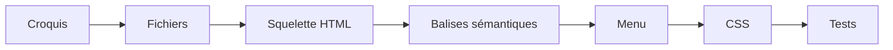
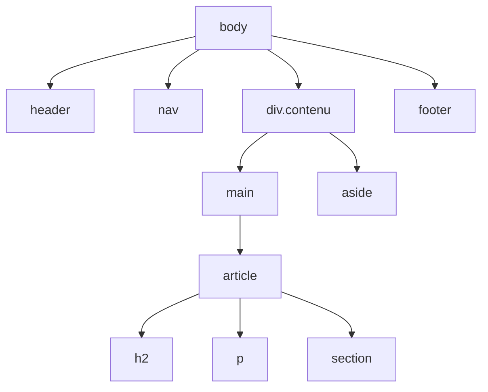
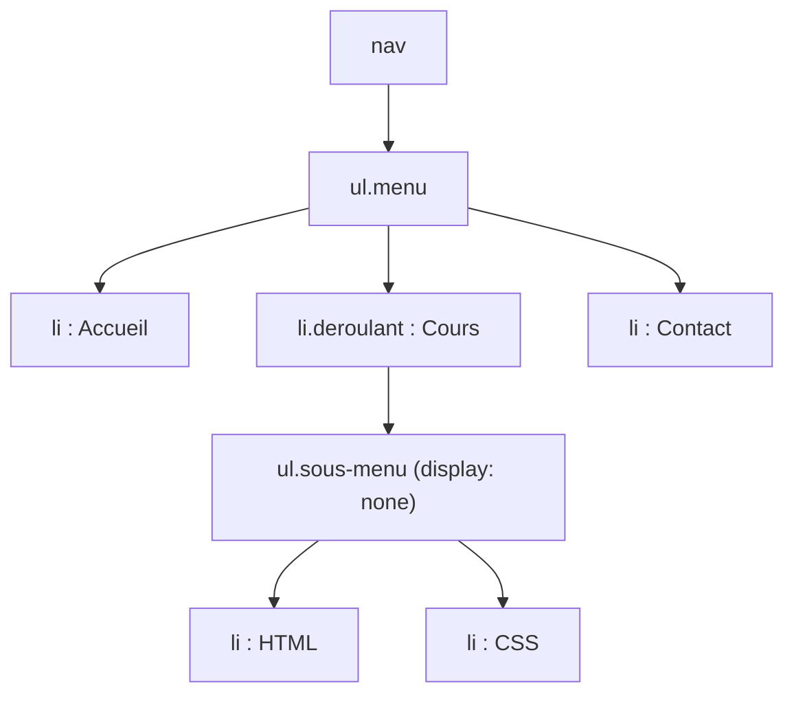

## Méthodologie : créer une feuille HTML avec menu déroulant

### 1. Les étapes

```mermaid
flowchart LR
    A[Croquis] --> B[Fichiers] --> C[Squelette HTML] --> D[Balises sémantiques] --> E[Menu] --> F[CSS] --> G[Tests]
```

### 2. Structure de la page

```mermaid
flowchart TD
    body --> header
    body --> nav
    body --> contenu["div.contenu"]
    body --> footer
    contenu --> main
    contenu --> aside
    main --> article
    article --> h2
    article --> p
    article --> section
```

### 3. Structure du menu déroulant

```mermaid
flowchart TD
    nav --> menu["ul.menu"]
    menu --> accueil["li : Accueil"]
    menu --> deroulant["li.deroulant : Cours"]
    menu --> contact["li : Contact"]
    deroulant --> sous["ul.sous-menu (display: none)"]
    sous --> html["li : HTML"]
    sous --> css["li : CSS"]
```